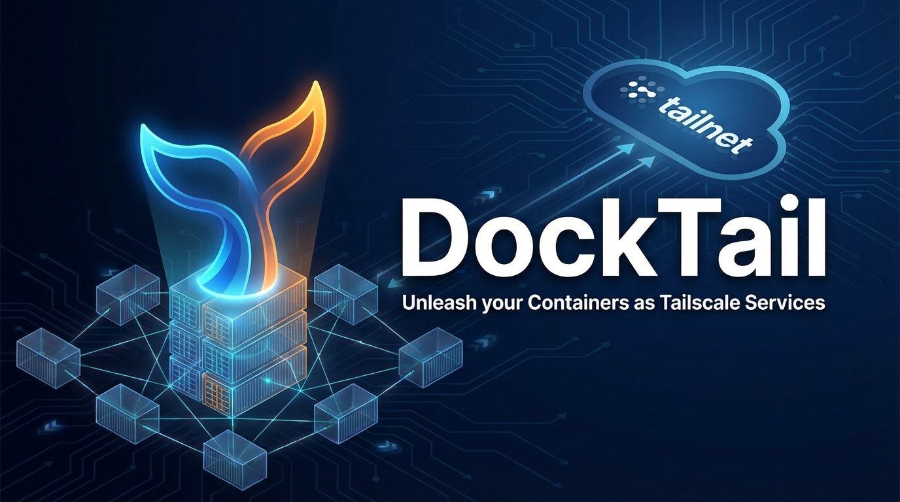

# 🍸 DockTail

**Unleash your containers as Tailscale Services.**

<p align="center">
  
</p>

<p align="center">
  <a href="https://tailscale.com/community/community-projects/docktail">
    
  </a>
</p>

DockTail watches Docker containers, reads `docktail.*` labels, and exposes matching containers as Tailscale Services. App containers do not need published Docker ports by default; DockTail proxies directly to their Docker network IPs.

## Why DockTail?

DockTail uses native Tailscale Services, not per-container Tailscale devices.

| | DockTail | TSDProxy | ScaleTail | tsbridge | Plain Services |
|---|---:|---:|---:|---:|---:|
| Native Tailscale Services | ✅ | ❌ | ❌ | ❌ | ✅ |
| Configured via Docker labels | ✅ | ✅ | ❌ | ✅ | ❌ |
| Apps do not consume separate Tailscale device slots | ✅ | ❌ | ❌ | ❌ | ✅ |
| No app port publishing | ✅ | ⚠️¹ | ⚠️² | ⚠️¹ | ⚠️³ |
| Automatic Docker reconciliation | ✅ | ✅ | ❌ | ✅ | ❌ |
| Low manual setup after install | ✅ | ✅ | ⚠️⁴ | ✅ | ❌ |

- ¹ Depends on proxy and Docker network setup.
- ² Depends on the sidecar template and app network setup.
- ³ You configure how the service host reaches the backend yourself.
- ⁴ ScaleTail is template-based, so each app usually starts from its own Compose recipe.

## Features

- Automatic Docker container discovery through labels.
- Automatic Tailscale service creation with OAuth or API key credentials.
- HTTP, HTTPS, TCP, and TLS-terminated TCP support.
- Tailscale HTTPS with automatic certificates.
- Tailscale Funnel for public internet access.
- Multiple Tailscale services from one container.
- Automatic reconciliation when containers restart or IPs change.
- Optional cleanup of unused Tailscale service definitions (opt-in, safe with multiple instances).
- Stateless Docker container runtime.
- Optional [DockTail Cloud](https://docktail.org/cloud/) reporting — multi-host monitoring, opt-in via one env var.

## Quick Start

```yaml
services:
  docktail:
    image: ghcr.io/marvinvr/docktail:latest
    restart: unless-stopped
    volumes:
      - /var/run/docker.sock:/var/run/docker.sock:ro
      - /var/run/tailscale:/var/run/tailscale
    environment:
      # Optional but recommended. Enables automatic service creation.
      - TAILSCALE_OAUTH_CLIENT_ID=${TAILSCALE_OAUTH_CLIENT_ID}
      - TAILSCALE_OAUTH_CLIENT_SECRET=${TAILSCALE_OAUTH_CLIENT_SECRET}

  myapp:
    image: nginx:latest
    # No ports needed. DockTail proxies directly to the container IP.
    labels:
      - "docktail.service.enable=true"
      - "docktail.service.name=myapp"
      - "docktail.service.port=80"
```

```bash
docker compose up -d
curl http://myapp.your-tailnet.ts.net
```

This assumes the Docker host is connected to Tailscale and allowed to advertise services. See the full docs for host setup, sidecar setup, OAuth permissions, ACLs, labels, Funnel, and examples.

For Docker secrets or other mounted secret files, set `FILE__TAILSCALE_OAUTH_CLIENT_ID` / `FILE__TAILSCALE_OAUTH_CLIENT_SECRET` or `TAILSCALE_OAUTH_CLIENT_ID_FILE` / `TAILSCALE_OAUTH_CLIENT_SECRET_FILE` to the mounted file paths instead of putting the values directly in the environment.

## Common Examples

Expose an app with Tailscale HTTPS:

```yaml
labels:
  - "docktail.service.enable=true"
  - "docktail.service.name=api"
  - "docktail.service.port=3000"
  - "docktail.service.service-port=443"
```

Expose a database over TCP:

```yaml
labels:
  - "docktail.service.enable=true"
  - "docktail.service.name=db"
  - "docktail.service.port=5432"
  - "docktail.service.protocol=tcp"
  - "docktail.service.service-port=5432"
```

Expose a service publicly with Tailscale Funnel:

```yaml
labels:
  - "docktail.funnel.enable=true"
  - "docktail.funnel.port=3000"
  - "docktail.funnel.funnel-port=8443"
```

Mount an HTTP(S) Funnel at a path:

```yaml
labels:
  - "docktail.funnel.enable=true"
  - "docktail.funnel.port=3000"
  - "docktail.funnel.path=/webhook"
```

## DockTail Cloud (optional)

Once you run DockTail on more than one machine, "is it still up?" gets tedious. [DockTail Cloud](https://docktail.org/cloud/) is a hosted dashboard for that — and because it already has the Docker and Tailscale context, it tells you *which* kind of broken you're looking at:

```text
● down · exit 137 · likely OOM        →  the container failed
● local up · tailnet not served       →  the app is fine, the exposure isn't
● host offline · heartbeat missing    →  the whole box went away
```

It rides along with the agent you already run — no second binary. Set one environment variable and the same container starts reporting:

```yaml
environment:
  - DOCKTAIL_CLOUD_KEY=${DOCKTAIL_CLOUD_KEY}   # from cloud.docktail.org
```

Without the key the module is completely inert: no connection is opened and DockTail behaves exactly as before. The link is outbound-only and metadata-only — the protocol has no exec, deploy, or shell message types, which you can verify in [`cloud/`](cloud/).

[Explore DockTail Cloud](https://docktail.org/cloud/) · [open the dashboard](https://cloud.docktail.org/login) · [agent setup](docs/06-cloud.md)

## Documentation

- Human docs: https://docktail.org/docs/
- Markdown docs: https://docktail.org/docs.md
- LLM guide: https://docktail.org/llms.txt
- Full LLM docs: https://docktail.org/llms-full.txt

- DockTail Cloud overview: https://docktail.org/cloud/
- Optional Cloud agent setup: [`docs/06-cloud.md`](docs/06-cloud.md)

The canonical documentation source lives in [`docs/`](docs/). Website docs are generated from those Markdown files.

## Build From Source

```bash
go build -o docktail .
docker build -t docktail:latest .
```

## Links

- [Tailscale Services Documentation](https://tailscale.com/kb/1552/tailscale-services)
- [Tailscale Funnel Documentation](https://tailscale.com/kb/1311/tailscale-funnel)
- [Tailscale Service Configuration Reference](https://tailscale.com/kb/1589/tailscale-services-configuration-file)
- [Docker SDK for Go](https://docs.docker.com/engine/api/sdk/)

## Star History

<a href="https://www.star-history.com/?type=date&legend=top-left&repos=marvinvr%2Fdocktail">
 <picture>
   <source media="(prefers-color-scheme: dark)" srcset="https://api.star-history.com/chart?repos=marvinvr/docktail&type=date&theme=dark&legend=top-left&sealed_token=tGE33ZV1yoq6Xh_yVB7IfUCG1bCcpFGEKG-pLYGE-y3DfXukM6ROnFGo2IO6Mnuyne8fGrG384yVF9imwzgj4c59yVt6_gBvbs3bK3HiokR1-ePqnqKUYyVdrLiMX26yZXGrDgwGavQ4t5M-MC2BnVwfYbW8I4e6bIWHF8cTqPODm2JNSOuP3W5aAL_o" />
   <source media="(prefers-color-scheme: light)" srcset="https://api.star-history.com/chart?repos=marvinvr/docktail&type=date&legend=top-left&sealed_token=tGE33ZV1yoq6Xh_yVB7IfUCG1bCcpFGEKG-pLYGE-y3DfXukM6ROnFGo2IO6Mnuyne8fGrG384yVF9imwzgj4c59yVt6_gBvbs3bK3HiokR1-ePqnqKUYyVdrLiMX26yZXGrDgwGavQ4t5M-MC2BnVwfYbW8I4e6bIWHF8cTqPODm2JNSOuP3W5aAL_o" />
   
 </picture>
</a>

## License

AGPL v3

----
By [@marvinvr](https://marvinvr.ch)
